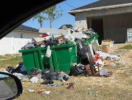
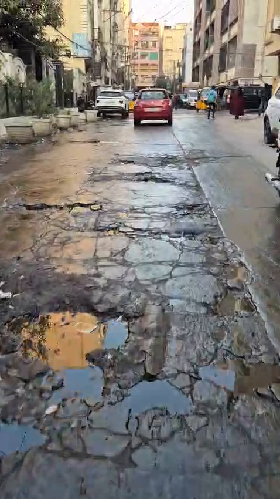
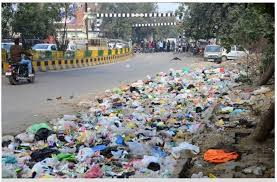
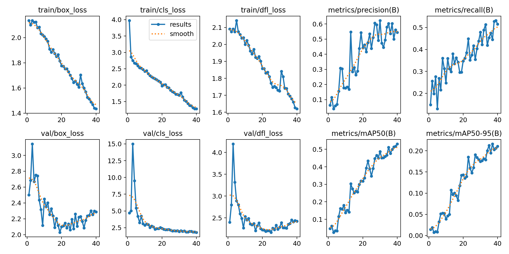
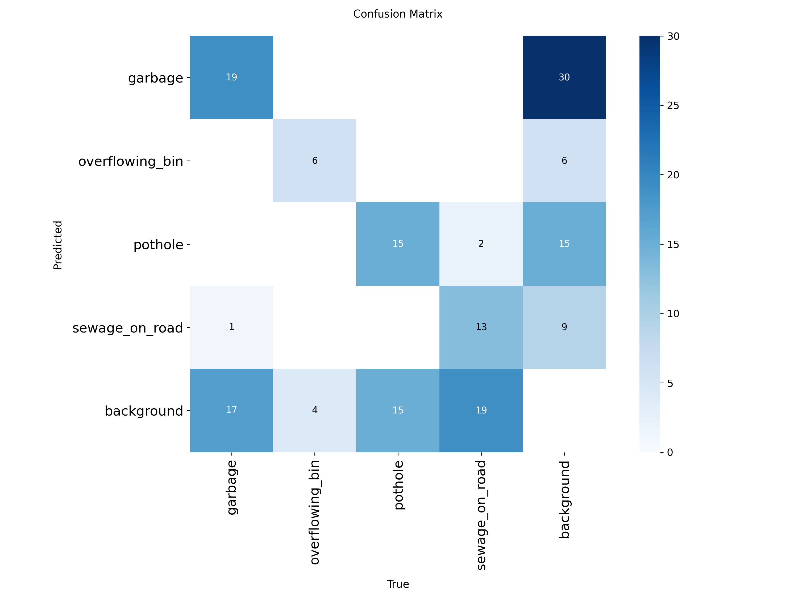
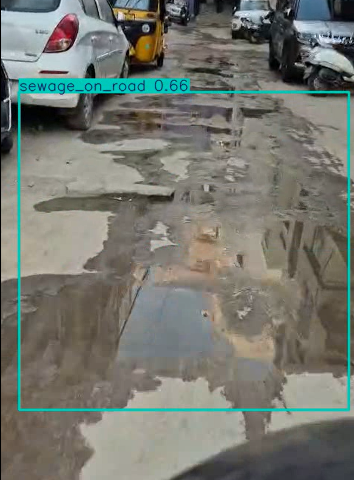

# UrbanEye: Real-Time Detection of Civic Issues for Urban Monitoring

UrbanEye is a computer vision project developed as part of the **iHub Computer Vision Internship**.  
The system detects common civic issues from real-world street-level videos using a YOLOv11n object detection model.

The goal of this project is **learning and practical application of object detection**.

---

## 🚩 Civic Issues Detected

The model is trained to detect the following classes:

- Garbage on roadsides
- Overflowing garbage bins
- Potholes
- Sewage / wastewater on roads

---

## 📊 Dataset Creation

- Source videos were collected from:
  - Public YouTube street-walk and news footage
  - Self-recorded mobile videos
- Frames were extracted and **manually filtered** to remove:
  - near-duplicate frames
  - extremely blurry or unclear samples
- Annotations were performed using **Label Studio**
- Care was taken to ensure **class balance**, especially for overflowing bins

### Sample Training Images
<p align="center">
  
  
  
</p>

---

## 🧠 Model & Training

- Model: **YOLOv8 (Ultralytics)**
- Training approach:
  - Transfer learning from a pretrained YOLOv8 model
  - Fine-tuned on the custom civic issue dataset
- Training configuration was passed via CLI and logged in `args.yaml`

Key details:
- Image size: 640×640
- Optimized confidence threshold: **0.35**
- Dataset imbalance was addressed through additional annotation

---

## 📈 Results

### Detection Performance
The model achieves reliable detection on real-world street footage, especially for visually distinct classes such as garbage piles and potholes.

### Training Metrics
<p align="center">
  
</p>

### Confusion Matrix
<p align="center">
  
</p>

---

## 🎥 Inference Results

The trained model was tested on **unseen videos**, including both YouTube and phone-recorded footage.

<p align="center">
  
  
  
</p>

---

## 🛠️ How to Run

```bash
pip install -r requirements.txt
yolo predict model=weights/best.pt source=demo_video.mp4 conf=0.35
